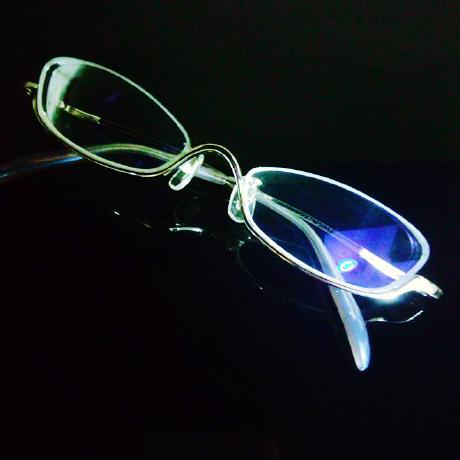
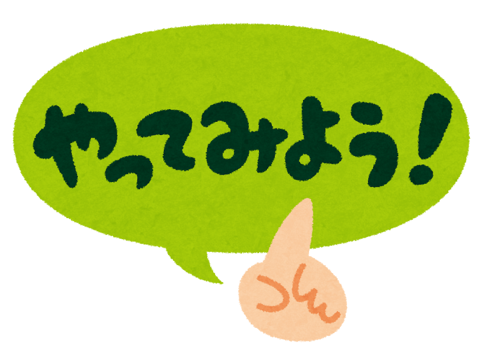
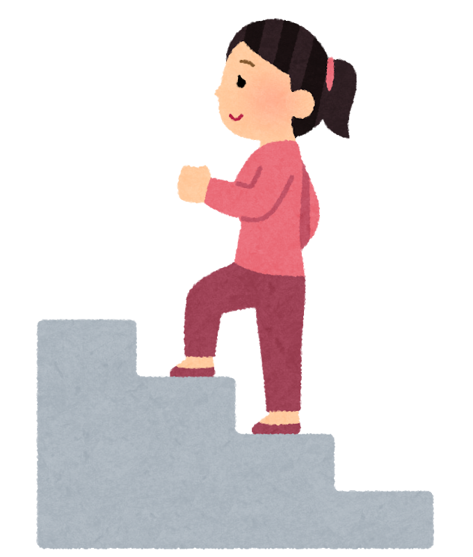

---?image=template/img/arrows-1229845_1920.jpg&size=auto
@snap[bg-top rounded]
## 今始まるストーリー
@snapend
@snap[south-east text-07 bg-top rounded]
エンジニアの登壇を応援する忘年LT大会  
2018.12.27  
hekitter  
@snapend

---
@snap[north]
### 自己紹介
@snapend

@snap[west]
 - [hekitter](https://twitter.com/hekitter)  
 - エモいエンジニア見習いSIer  
 - 日本酒が飲みたい     
    
 詳細は[aozora.fm](https://fortegp05.github.io/aozorafm/)  
 第7回／第8回（ゲスト出演回）へ
@snapend

@snap[east]

@snapend
---
@snap[north  span-90]
### YWTでふりかえろう
@snapend

1.Y=やったこと 
2.W=わかったこと 
3.T=つぎにやること 

---
@snap[midpoint text-20 span-80]
1. Y=やったこと
@snapend

---
@snap[north]
### やったこと
@snapend

- Twitter開始 
- イベント・勉強会参加 
- イベント主催 
- 初LT 
- [blog](https://hekitter.hatenablog.com/)開始 
- Podcastにゲスト出演 
- 合同誌寄稿 
---
@snap[midpoint text-20 span-80]
全部10月以降の  
出来事です！！  
@snapend
---
@snap[midpoint text-30 span-100 text-pink] 
マジほめて！！
@snapend

---

@snap[midpoint text-20 span-80]
2. W=わかったこと
@snapend

---
@snap[north  span-90]
### わかったこと
@snapend

* チャレンジすることは楽しい |
* チャレンジすると優しい世界がある |

---
@snap[north  span-60]
### 見えない天上界
@snapend

@snap[north-west]

@snapend

@snap[midpoint span-90] 

@snapend

@snap[south-east]

@snapend

---
@snap[north  span-60]
### やればできる
@snapend

@snap[north-west span-100]

@snapend

@snap[south-east]

@snapend

---

@snap[midpoint text-20 span-80]
3. T=つぎにやること
@snapend

---
@snap[north]
### つぎにやること
@snapend

@css[text-13](自分の行動で)
 * 素敵な世界を作る  |
 * なりたい自分を作る  |
---
 
@snap[north span-90]
### 素敵な世界とは？
「いいもの」を仕組化・共有して、 
みんなで幸せになる
@snapend

@snap[west  span-30 fragment]
@box[bg-silver rounded](@css[text-pink text-20](力)#思考・技術 )
@snapend
 
@snap[midpoint  span-30 fragment]
@box[bg-silver rounded](@css[text-pink text-20](人脈)#仲間・同志 )
@snapend
 
@snap[east  span-30 fragment]
@box[bg-silver rounded](@css[text-pink text-20](場)#コミュニティ)
@snapend

 
---

@snap[north span-80]
### なりたい自分とは？  
思考に限界を設けず、達成していき、 
みんなに活力を与えられる人  
@snapend

@snap[west  span-40 fragment]
@box[bg-silver rounded](@css[text-pink text-20](越境者)#「枠」を越えて 実現していく)
@snapend

@snap[east span-40 fragment]
@box[bg-silver rounded](@css[text-pink text-20](体現者)#「夢」を現実化 していく)
@snapend

---
@snap[north]
### 私の2019年
@snapend

@snap[midpoint span-70 text-13]
@css[text-pink](「hekitterにつづけ」)と  
いわれるくらい  
これからもどんどん  
@snapend

---

@snap[midpoint text-20 span-80]
yatteiki！！
@snapend

---?image=template/img/live-concert-388160_1920.jpg
@snap[north bg-top]
### さいごに
@snapend

@css[span-70 text-13]
> 自由にもっと輝いて  
> きらめく星のように  
> 今 始まるストーリー  
> 未来はそこにあるよ  

@snap[south span-80 text-white]
アイドルマスターSideM  
『DRIVE A LIVE』より
@snapend
